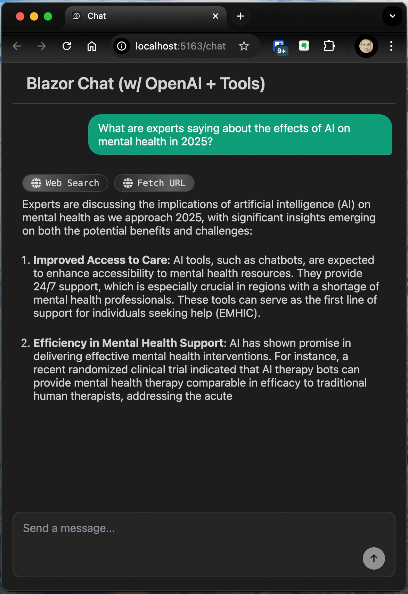

# Blazor Chat with OpenAI

A modern Blazor Server application that demonstrates integration with OpenAI's API to create an interactive chat experience with real-time tool execution feedback.



## Features

- Real-time streaming chat interface with OpenAI's GPT models
- Tool execution with visual feedback
- Web search capability using Brave Search API
- URL content fetching and parsing
- Markdown rendering for chat messages
- Responsive design

## Technologies

- .NET 9.0
- Blazor Server
- OpenAI API
- Markdig for Markdown processing
- HtmlAgilityPack for HTML parsing

## Getting Started

### Prerequisites

- .NET 9.0 SDK or later
- OpenAI API key
- Brave Search API key (optional, for web search functionality)

### Setup

1. Clone the repository
   ```
   git clone https://github.com/azevedojoel/BlazorChat.git
   cd BlazorChat
   ```

2. Set your API keys
   ```
   # Windows
   setx OPENAI_API_KEY "your-openai-api-key"
   setx BRAVE_API_KEY "your-brave-api-key"
   
   # Linux/macOS
   export OPENAI_API_KEY="your-openai-api-key"
   export BRAVE_API_KEY="your-brave-api-key"
   ```

   Alternatively, update your `appsettings.json` file:
   ```json
   {
     "OpenAI": {
       "ApiKey": "your-openai-api-key"
     },
     "Brave": {
       "ApiKey": "your-brave-api-key"
     }
   }
   ```

3. Run the application
   ```
   dotnet run
   ```

4. Open your browser and navigate to `https://localhost:7266` or `http://localhost:5163`

## How It Works

The application uses Blazor Server to create a responsive chat interface. When a user sends a message, it's processed by the OpenAI API using the specified model (currently gpt-4o-mini).

The chat includes two tools:
1. **Web Search Tool**: Searches the web using Brave Search API
2. **URL Fetch Tool**: Retrieves and parses content from specified URLs

The UI provides real-time feedback on tool execution status with visual indicators for:
- Calling
- Processing
- Done

## License

This project is licensed under the MIT License - see the LICENSE file for details.

## Acknowledgments

- [OpenAI](https://openai.com/) for their powerful API
- [Brave Search](https://brave.com/search/) for web search capabilities
- [Open Iconic](https://github.com/iconic/open-iconic) for icons
